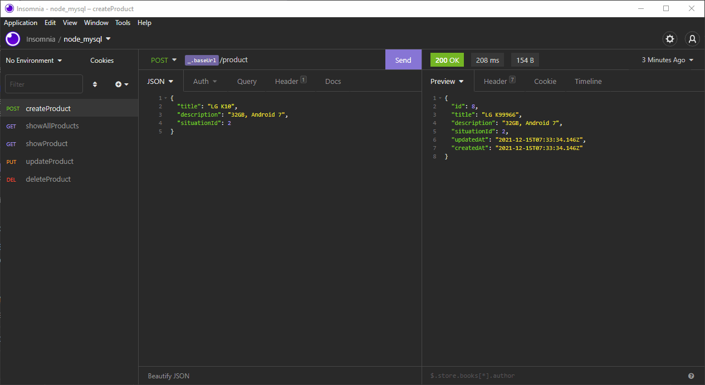

<h1 align="center">Starting with Jest in a Node.js API</h1>

 

  <a href="#rocket-technologies">Technologies</a>&nbsp;&nbsp;&nbsp;|&nbsp;&nbsp;&nbsp;
   <a href="#-project">Project</a>&nbsp;&nbsp;&nbsp;|&nbsp;&nbsp;&nbsp;
  <a href="#electric_plug-getting-started">Getting started</a>

 

<h2>Project working:<h2>

    

## :rocket: Technologies

In this project was used the JavaScript testing framework Jest in a REST API, made in `Node.js` with `Express`,` Nodemon`, `Sequelize` and the `MySQL` database. The `SQLite` database was used during tests

## 💻 Project

This is a study project on how to unit test in an API in Node.js with Sequelize, Express and MySQL. And SQLite during tests :books:

## :electric_plug: Getting started

1. Clone this repository using: `git@github.com:Henry001-prog/iniciando-com-o-jest-no-nodejs.git`
2. Enter in the project directory: `cd iniciando-com-o-jest-no-nodejs`
3. Install all dependencies running in terminal: `yarn`
4. Run `yarn run dev` in another terminal or in the terminal of the code editor you use to run the project. Or run `yarn test` to perform the tests.